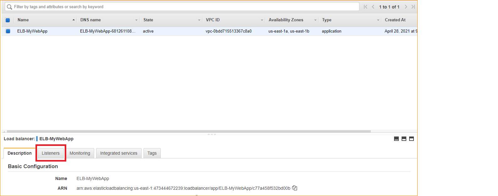
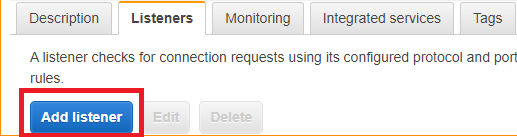
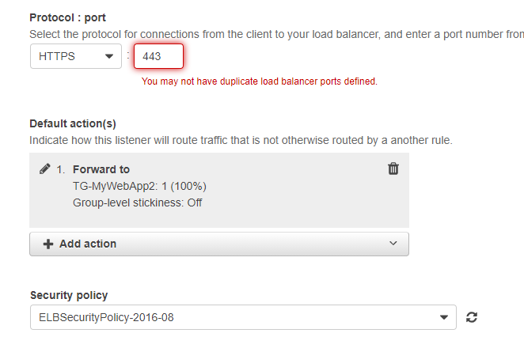
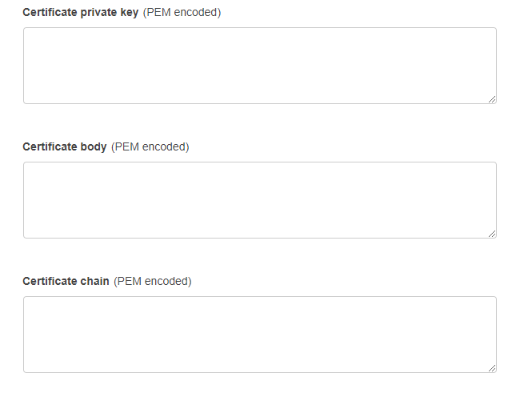

# **Documentacion para la incorporacion de certificados ssl en el dominio**

## **Tabla de contenidos**
- [**Documentacion para la incorporacion de certificados ssl en el dominio**](#documentacion-para-la-incorporacion-de-certificados-ssl-en-el-dominio)
  - [**Tabla de contenidos**](#tabla-de-contenidos)
  - [**Introduccion**](#introduccion)
  - [**Desarollo**](#desarollo)
    - [**Generacion del certificado en la maquina monolitica**](#generacion-del-certificado-en-la-maquina-monolitica)
    - [**Pasos extras para el desarollo en el sistema escalable**](#pasos-extras-para-el-desarollo-en-el-sistema-escalable)
  - [**Conclusiones**](#conclusiones)


## **Introduccion**

En este documento se especifica la creacion de certificados ssl para peticiones https, atraves del proveedor de este servicio en este caso letsencrypt, se busca atraves vez de esta documentacion explicar el proceso por el cual se piden certificados tanto para maquinas monoliticas como para sistemas escalables en la nube


## **Desarollo**

### **Generacion del certificado en la maquina monolitica**

Primero instalaremos nginx, debido a que este nos servira para comprobar los certificados junto con certbot.

```
sudo amazon-linux-extras install epel -y

sudo yum install certbot-nginx -y

sudo yum install nginx -y
```

Llegados a este punto correremos el comando descrito abajo con el fin de la generacion de los certificados ssl, en el apartado que se menciona abajo de subdominio pondremos nuestro dominio en el caso del proyecto quedaria de la siguiente manera. *.risais.ml

```
sudo certbot --server https://acme-v02.api.letsencrypt.org/directory -d *.sudominio.com --manual --preferred-challenges dns-01 certonly
```

Crearemos las carpetas donde estaran alojandos los certificados, para su uso despues

```

mkdir /home/ec2-user/wordpress
mkdir /home/ec2-user/wordpress/ssl
sudo su


```

Copiaremos los diferentes archivos de los certificados, de los directorios creados anteriormente

```
cp /etc/letsencrypt/live/sudominio.com/* /home/ec2-user/wordpress/ssl/

cp /etc/letsencrypt/options-ssl-nginx.conf /home/ec2-user/wordpress/ssl/
cp /etc/letsencrypt/ssl-dhparams.pem /home/ec2-user/wordpress/ssl/
exit
```
En este caso clonaremos el siguiente repositorio que contiene las diferencias dependencias, para la instalacion de un wordpress con certificado

```
git clone https://github.com/svalenciaaq/cetificadosSSL.git

cd svalenciaaq/certificadoSSL
sudo cp docker-compose.yml /home/ec2-user/wordpress
sudo cp nginx.conf /home/ec2-user/wordpress
sudo cp ssl.conf /home/ec2-user/wordpress

```
Comprobaremos que el servicio este corriendo, y reiniciaremos la maquina

```
ps ax | grep nginx
netstat -an | grep 80

sudo reboot
```
Por ultimo accederemos a la carpeta y correremos el comando que nos permita la creacion de las diferentes imagenes 

```
cd /home/ec2-user/wordpress
docker-compose up --build -d
```

### **Pasos extras para el desarollo en el sistema escalable**

En el caso para el sistema escalable deberemos incorporar los certificados al balanceador de carga, esto atraves de los listener que proporciona

Se ingresa al servicio de load balancer y se presiona en listeners



Se presiona Add listener para agregar un nuevo listener



En el protocolo pondremos https y en la acciones pondremos Fordwar to(El servicio de target configurado para este)




Por ultimo agregaremos los certificados que fueron generados en los pasos anteriores para mas claridad se describira cada uno de los certificados utilizados.


* Certificate private key(PEM encoded): (copy-paste de privkey.pem)
* Certificate body(PEM encoded): (copy-paste de cert.pem)
* Certificate chain(PEM encoded): (copy-paste de chain.pem)





## **Conclusiones**

Como se observa la obtencion de los certificados ssl, no es algo muy complicado debido a que se tiene servicios muy faciles de implementar para esto, cabe recalcar que en este caso se utiliza los certificados generados en el load balancer debido a que aws educate no permite la generacion automatica de estos, como si los ofreceria en cuentas comunes
