# Documentacion para el DNS

## Tabla de contenidos
- [Documentacion para el DNS](#documentacion-para-el-dns)
  - [Tabla de contenidos](#tabla-de-contenidos)
  - [Descripcion](#descripcion)
  - [Proceso de  migracion de freenom a cloudflare](#proceso-de--migracion-de-freenom-a-cloudflare)
  - [Configuracion del DNS](#configuracion-del-dns)

## Descripcion

En este documento se especifica la configuracion de un servicio de DNS, proveniente de cloudflare donde se configurar un dominio en este, esto con la intencion de hacer uso de los beneficios que proporciona cloudflare
 
## Proceso de  migracion de freenom a cloudflare

En estos se buscara migrar el manejo del DNS desde freenom hacia cloudflare.

En este primer paso se buscara el agregar el dominio en cloudflare.

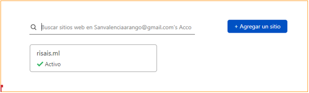

Agregaremos el nombre de nuestro dominio para que sea buscado por cloudflare

Seleccionaremos el plan que utilizaremos en el servicio de cloudflare, en este caso como es un ambito academico seleccionaremos gratis

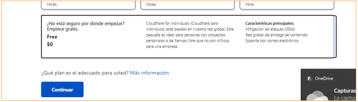

Despues de esto cloudflare se encargara de escanear los registros existentes del DNS

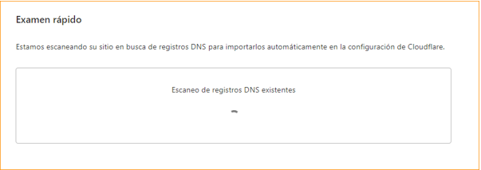

Luego tendremos que configurar nuestros propios servidores autoritarios que se encargaran de manejar el DNS, estos son proporcionados por cloudflare.

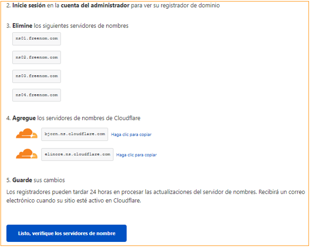

Para esto iremos al proveedor del dominio, en este cason tenemos freenom, y seleccionaremos el dominio que queremos migrar.

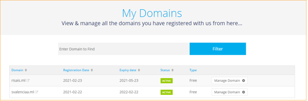

Dentro del dashboard del dominio seleccionaremos el management tools, donde seleccionaremos nameservers donde pondremos los servidores que fueron dados por cloudflare

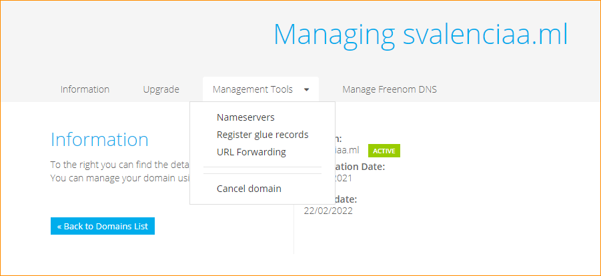

Pondremos use custom nameservers, y pondremos los dos servidores que fueron dados

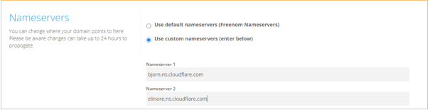

Configuraremos la seguridad del DNS

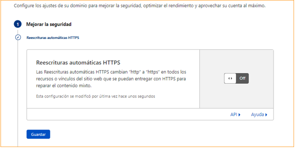

Tambien configuraremos el rendimiento por parte de cloudflare

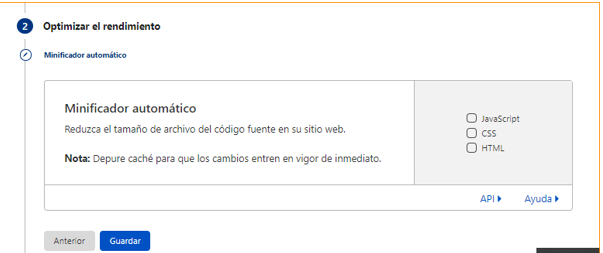

Por ultimo comprobaremos que las configuraciones dadas si estan correctas

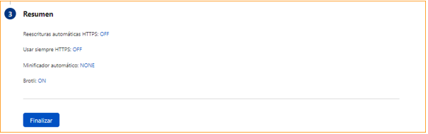

## Configuracion del DNS

Cuando se termine la migracion del DNS procederemos  a configurar los registros de los DNS

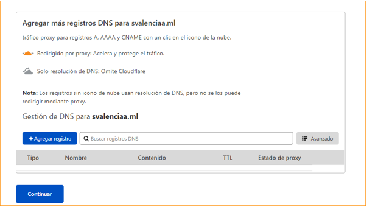

En este paso configuraremos los siguientes registros que nos permitiran redireccionar las peticiones que llegan al dominio

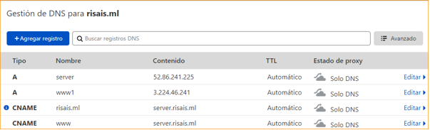
