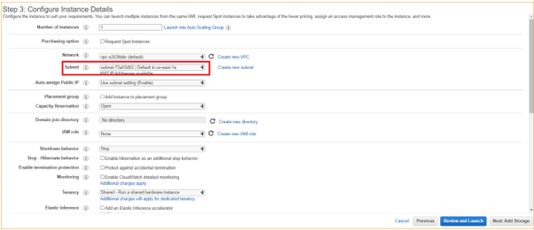
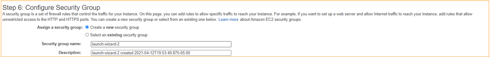
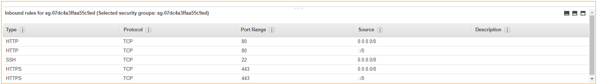

- [Documentacion para la creacion de un sistema monolitico basado en wordpress](#documentacion-para-la-creacion-de-un-sistema-monolitico-basado-en-wordpress)
  - [Creacion de la instacian EC2](#creacion-de-la-instacian-ec2)
  - [Instalacion de docker](#instalacion-de-docker)
  - [Instalación Docker-compose en la VM de AWS EC2](#instalación-docker-compose-en-la-vm-de-aws-ec2)
  - [Instalacion Wordpress con Docker en AWS](#instalacion-wordpress-con-docker-en-aws)


# Documentacion para la creacion de un sistema monolitico basado en wordpress

En este documento se explica la creacion de un sistema monolitico basado en wordpress, el sistema sera realizado con docker y la herramiento docker-compose, donde se descargaran las imagen provenientes del docker hub, tanto para la instancia del wordpress como para la instancia de la base de datos, todo este soportado por los servicios de aws educate.


## Creacion de la instacian EC2

Empezaremos creando la instancia EC2 en amazon para esto, en el dashboard de aws, escogeremos el servicio EC2, y escogeremos el launch instance


Seleccionaremos la imagen Linux 2 AMI


Seleccionaremos la maquina t2.micro


Seleccionaremos la subnet donde queremos almacenar nuestra instancia



Escogeremos la cantidad de espacio de almacenamiento que queremos tener la instancia, en este caso lo dejaromos por default en 8 gb de almacenamiento


Escogeremos el grupo de seguridad en este caso el grupo de seguridad, abriremos los puertos 80 y 443 correspondientes a http y hhtps



Como se puede observar en la imagen se selecciona los puertos




## Instalacion de docker

Instalaremos docker para manejar el sistema atraves de contenedores, ademas  de instalar git.

```
sudo amazon-linux-extras install docker 

sudo yum install git 

sudo systemctl enable docker 

sudo systemctl start docker 

sudo usermod -a -G docker ec2-user 

```

## Instalación Docker-compose en la VM de AWS EC2

Instalaremos docker-compose para el manejo de multiples contenedores

```
sudo curl -L https://github.com/docker/compose/releases/download/1.28.4/docker-compose-`uname -s`-`uname -m` -o /usr/local/bin/docker-compose

sudo chmod +x /usr/local/bin/docker-compose

sudo reboot

```

## Instalacion Wordpress con Docker en AWS

Para la instalacion del wordpress crearemos un archivo docker-compose.yml donde pondremos el contenido que esta abajo, en este caso podremos modificar las credenciales de conexion a la base de datos que garantize el funcionamiento de la aplicacion

```
version: '3.1'

services:

  wordpress:
    image: wordpress
    restart: always
    ports:
      - 8080:80
    environment:
      WORDPRESS_DB_HOST: db
      WORDPRESS_DB_USER: exampleuser
      WORDPRESS_DB_PASSWORD: examplepass
      WORDPRESS_DB_NAME: exampledb
    volumes:
      - wordpress:/var/www/html

  db:
    image: mysql:5.7
    restart: always
    environment:
      MYSQL_DATABASE: exampledb
      MYSQL_USER: exampleuser
      MYSQL_PASSWORD: examplepass
      MYSQL_RANDOM_ROOT_PASSWORD: '1'
    volumes:
      - db:/var/lib/mysql

volumes:
  wordpress:
  db:

```